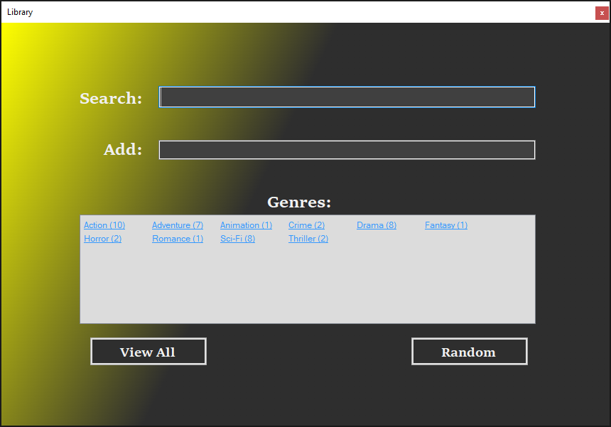
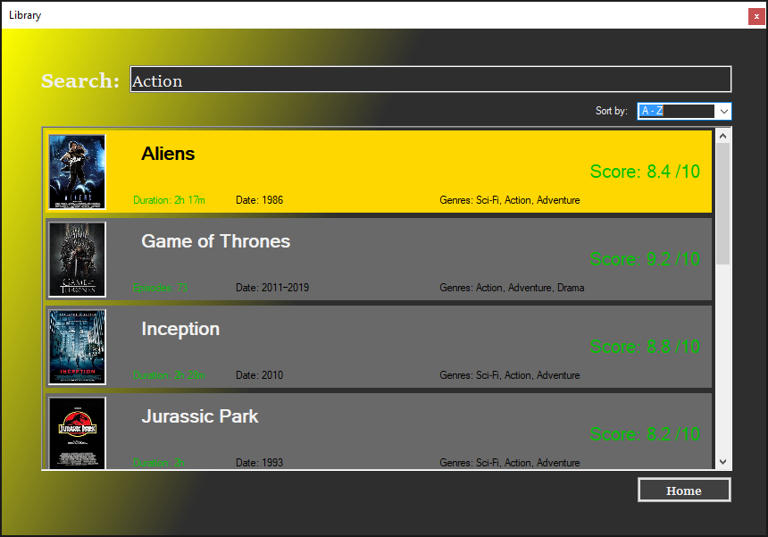
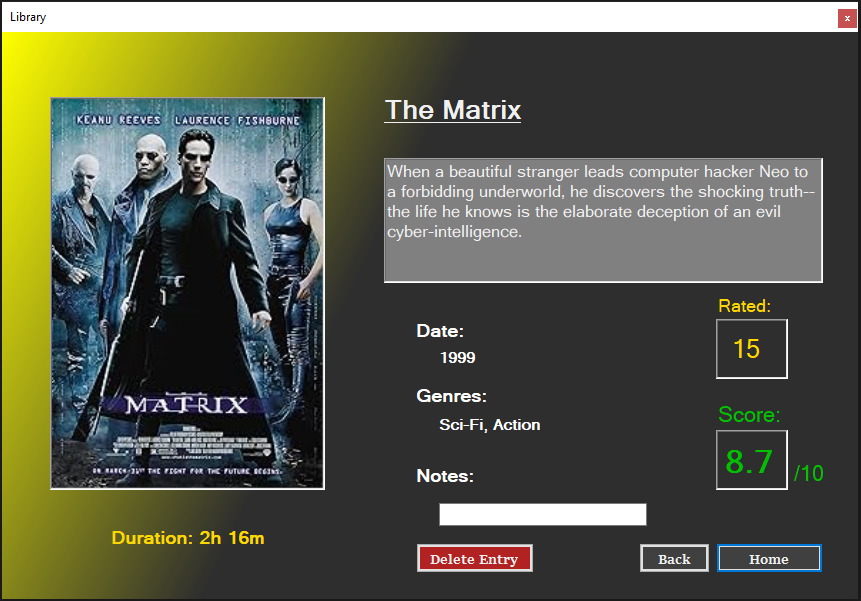
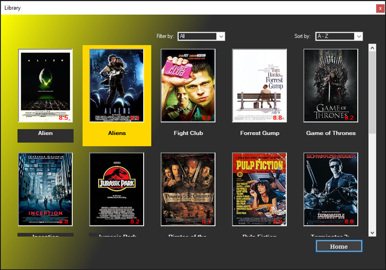

# movie_library

### Description

This is a C# WinForms project designed to use web scraping and allow the user to create an off-line database of movie entries. Specifically via the IMDb website the user can paste the URL of a film's page into the 'Add' textbox (shown below in the first screenshot) to scrape the information from the page and add it to the database.

### Screenshots

  
  &nbsp; &nbsp; &nbsp; &nbsp;
  

  
  &nbsp; &nbsp; &nbsp; &nbsp;
  

*Screenshot 1). The home page.*

*Screenshot 2). The search results page.*

*Screenshot 3). The view entry page, allows the user to view an entry in detail and also delete and add notes to an entry.*

*Screenshot 4). The view all page, providing tiles for all stored entries and the ability to sort and filter them.*

(*full size images can be found [here](./screenshots)*)

### What was learnt

This project was initially intended as additional practice with C#, SQL and working with databases. Web scraping was something I had not done before so this was a good way to explore that. I learnt more about WinForms, in particular creating 'User Controls' and the memory limitations that come with them.

This project also gave me the opportunity to encounter issues I had not before, being the diagnosing and fixing of memory leaks, and a situation where user experience and code execution required balancing. In this application, once the database grows the re-loading of widgets in the 'View all' page after scraping an entry can take more and more time. As this happens at the same time as the loading of the view entry page, both things required to be done on the same thread, this can lock the UI on a partially loaded page and make the application unresponsive.

Ultimately the solution used, for simplicity, was to create a time delay. Allowing one page to load fully before the other loads in the background. This is predicated on the assumption the user will look at the newly scraped page for at least a couple of seconds but allows the relevant information to be re-loaded in the background without impacting the user as much. A better solution than the one chosen would've been to only deal with the necessary additional data for the newly scraped entry, but this was a failure of planning as the project grew beyond its original scope and would have required more extensive alterations.

### Application instructions

The following instructions will be grouped into four sections corresponding to the four pages of the application (as can be seen in the screenshots above).

##### Home page

This is where the application starts (screenshot 1). Here the user can:
- press the 'View All' button to go to the View all page.
- Press the 'Random' button to view a random entry from the database on the view entry page.
- Select a genre from the 'Genres' box (this contains all the genres for all currently stored entries and the counts) which takes the user to the search results page, displaying all entries that correspond to the selected genre.
- Search for an entry/entries using the search textbox.
- Add an entry to the database using the add textbox. Pasting the URL of a movie's page on IMDb such as 'https://www.imdb.com/title/tt0110357/?ref_=nv_sr_srsg_0_tt_8_nm_0_q_lion%2520king' and pressing 'Enter' will scrape and save the information from the page and display the entry with the view entry page.

##### Search results page

This page (screenshot 2) displays the results of a search or genre selection. Clicking on a result will take the user to the view entry page and display that result. The dropdown box in the top right allows the user to sort the results alphabetically, by rating, and by date of release.

##### View entry page

This page (screenshot 3) displays all the collected information for a selected entry. It also allows the deletion of an entry and the adding of notes. Adding a note only requires adding text to the 'Note' textbox, the page will check for changes to this field and save them accordingly.

##### View all page

This page displays all currently stored entries as tiles (as seen in screenshot 4). Clicking a tile will allow the user to view the entry in the view entry page. The dropdown boxes at the top of the page allow the user to:
- Sort the tiles alphabetically, by rating, and by release date.
- Filter the tiles by genre.

### How to use
- Clone the repository.
- Find the 'Rep2.sln' file and open the project with Microsoft Visual Studio.
- Press the play button to run the application.

##### Requirements:
 - C# support
 - .NETFramework, Version=v4.7.2
 - Microsoft Visual Studio. This application will be runnable with alternative IDEs, such as Visual Studio Code, or via terminal but has been written and tested using Microsoft Visual Studio so alternative instructions have not been given.
 - HtmlAgilityPack (NuGet package included with the project).

## License
This is a demonstration project and not intended for collaboration, as such a license has not been added meaning the default copyright laws apply and no one may reproduce, distribute, or create derivative works from this work.
